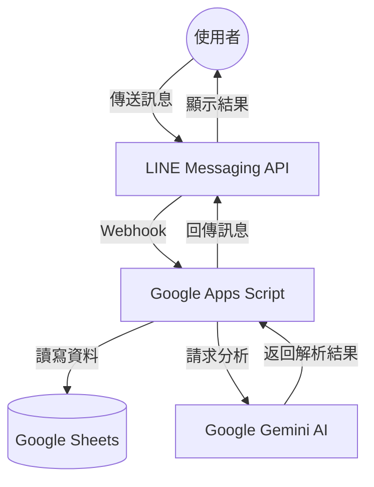

# 💰 Gemini LINE 記帳機器人 | Smart Expense Tracker

這是一個基於 Google Apps Script (GAS) 開發的智能記帳機器人。透過整合 Google Gemini AI 與 Google Sheets，使用者可以用「說人話」的方式完成記帳。本專案不僅是一個實用的工具，也是一份完整的 AI 整合開發教材。

## 📸 成果展示


## ✨ 主要功能

- 🤖 **智能記帳**：利用 Gemini AI 自動從自然語言中提取「品項」與「金額」，無需固定格式。
- 📊 **自動化數據庫**：所有資料即時寫入 Google Sheets，方便後續報表製作與管理。
- 🎭 **多樣化 AI 人設**：支援「正常模式」、「太監模式」等風格，讓理財過程更有趣。
- 📈 **支出分析報告**：AI 會根據歷史記錄，提供個性化的理財建議與消費總結。
- 📝 **日誌系統**：內建完整的日誌記錄功能，方便開發者進行後端除錯與監控。

## 🎓 學習與教學資源 (Slide Deck)

本專案包含一套完整的實作教學文件：
- 🛠️ [快速部署手冊](./docs/slide.pdf) —— 詳細的環境設定與 API 串接指南。

## 🏗️ 程式架構與流程

### 系統架構圖



### 資料流程說明

- **記帳流程**：使用者輸入 → Gemini 解析 → 寫入 Sheets → 計算今日累計 → LINE 回覆。
- **分析流程**：輸入分析關鍵字 → 讀取 Sheets 歷史 → Gemini 深度分析 → LINE 回覆。

## 🛠️ 技術細節

### 核心函式說明

| 函式類別 | 函式名稱 | 說明 |
| :--- | :--- | :--- |
| **配置管理** | `getConfig_()` | 安全管理 API Keys (使用 Script Properties) |
| **資料庫** | `initSheets()` / `addRecord_()` | 自動初始化工作表與寫入記帳資料 |
| **AI 核心** | `callGemini_()` | 串接 Gemini 1.5 系列模型進行生成 |
| **解析邏輯** | `parseExpenseWithAI_()` | 處理 Markdown 清理與 JSON 資料結構解析 |
| **Webhook** | `doPost(e)` | LINE Webhook 入口，處理所有訊息交換 |

## 🚀 安裝步驟

### 1. 專案初始化
1. 在 Google Sheets 中點選「擴充功能」->「Apps Script」。
2. 將原始碼貼入編輯器。
3. 執行 `setup()` 函式進行工作表初始化。

### 2. 設定環境變數
在 Apps Script 的「專案設定」中新增 Script Properties：
- `GEMINI_API_KEY`：從 Google AI Studio 取得。
- `LINE_CHANNEL_ACCESS_TOKEN`：從 LINE Developers 取得。
- `LINE_CHANNEL_SECRET`：從 LINE Developers 取得。

### 3. 部署與 Webhook
1. 點選「部署」->「新增部署作業」，類型選擇「網頁應用程式」。
2. 設定執行身分為「我」，存取權為「所有人」。
3. 將產生的 URL 填入 LINE Developers 的 Webhook URL 並啟用。

## 🎭 自訂設定 (Customization)

你可以輕鬆更換 AI 的回應語氣。在程式碼中修改 `CURRENT_PERSONA` 變數：

```javascript
// 可選設定：'normal' (專業理財建議) 或 'eunuch' (幽默太監風格)
const CURRENT_PERSONA = 'eunuch'; 
```
